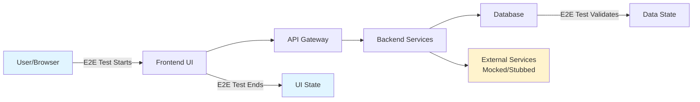
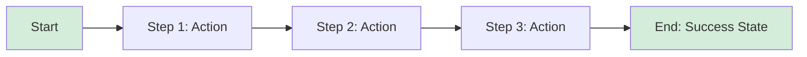
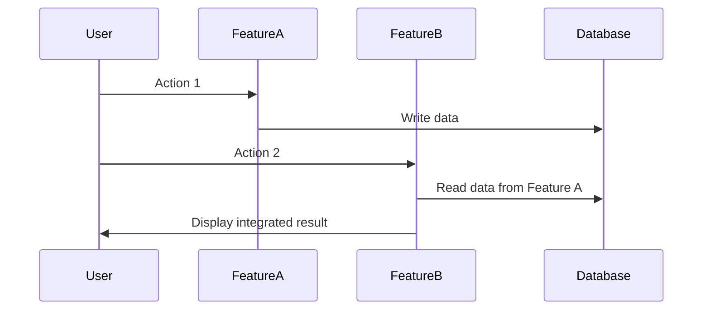

# End-to-End Test Plan: [PRODUCT/PROJECT NAME]

**Version**: 1.0 | **Date**: [DATE] | **Status**: Active  
**Maintained by**: [QA TEAM/TEST ARCHITECT] | **Last Reviewed**: [DATE]

**Note**: This document defines the end-to-end testing strategy, test scenarios, and execution plan for the entire product. It ensures comprehensive coverage of critical user journeys and system integration points.

---

## Document Control

| Version | Date | Author | Changes |
| --------- | ------ |--------|---------|
| 1.0 | [DATE] | [NAME] | Initial E2E test plan |
| | | | |

**Related Documents**:

- Architecture: `docs/architecture.md`
- Ground Rules: `docs/ground-rules.md`
- Feature Specifications: `specs/[###-feature]/spec.md`
- Standards: `docs/standards.md`

---

## Table of Contents

1. [Introduction](#1-introduction)
2. [Test Strategy](#2-test-strategy)
3. [Test Scope](#3-test-scope)
4. [User Journeys](#4-user-journeys)
5. [Test Scenarios](#5-test-scenarios)
6. [Test Data Management](#6-test-data-management)
7. [Test Environments](#7-test-environments)
8. [Test Framework & Tools](#8-test-framework--tools)
9. [Test Architecture](#9-test-architecture)
10. [Execution Plan](#10-execution-plan)
11. [Reporting & Metrics](#11-reporting--metrics)
12. [Maintenance & Improvement](#12-maintenance--improvement)
13. [Appendices](#13-appendices)

---

## 1. Introduction

### 1.1 Purpose

This document establishes the comprehensive end-to-end (E2E) testing strategy for [PRODUCT/PROJECT NAME]. E2E tests validate that the entire system works correctly as an integrated whole, from user interface through all backend services to data persistence and external integrations.

### 1.2 Goals

- **Validate critical user journeys** end-to-end across all system components
- **Ensure system integration** between frontend, backend, database, and external services
- **Verify business workflows** function correctly in production-like environments
- **Detect integration issues** early in the development cycle
- **Provide confidence** for releases through automated regression testing
- **Document expected behavior** through executable specifications

### 1.3 Audience

- QA Engineers implementing test automation
- Developers understanding test coverage
- Product Managers verifying business requirements
- DevOps Engineers setting up test infrastructure
- Project Managers tracking quality metrics

### 1.4 System Overview

<!--
  ACTION REQUIRED: Provide brief system overview based on architecture
-->

**Product Description**: [Brief description of the product]

**Key Components** (from architecture):

- Frontend: [e.g., React web app]
- Backend: [e.g., FastAPI REST API]
- Database: [e.g., PostgreSQL]
- External Integrations: [e.g., Payment gateway, Email service]
- Mobile: [e.g., React Native app (if applicable)]

**Reference Architecture**: See `docs/architecture.md` for detailed system architecture.

---

## 2. Test Strategy

### 2.1 Testing Approach

**E2E Test Philosophy**:

E2E tests in this project focus on:

- ✅ **Critical user paths** that deliver core business value
- ✅ **System integration points** between major components
- ✅ **Business workflows** spanning multiple features
- ✅ **User-visible behavior** from UI to database
- ❌ **NOT unit-level logic** (covered by unit tests)
- ❌ **NOT component-level details** (covered by integration tests)

**Test Pyramid Position**:

```
       /\        ← E2E Tests (Few, slow, broad coverage)
      /  \       ← Integration Tests (More, faster, component integration)
     /____\      ← Unit Tests (Many, fast, focused)
```

E2E tests are the **smallest layer** of the test pyramid but provide the **highest confidence** that the system works as a whole.

### 2.2 Testing Types

**Primary E2E Testing**:

- **UI-driven tests**: Simulate real user interactions through the browser/app
- **API-driven tests**: Validate backend workflows and integrations
- **Database validation**: Verify data persistence and integrity
- **Cross-system flows**: Test integrations with external services

**Supplementary Testing** (within E2E scope):

- **Visual regression**: Detect unintended UI changes
- **Accessibility**: Validate WCAG compliance in user flows
- **Performance**: Measure response times under realistic load
- **Security**: Test authentication, authorization, and data protection

### 2.3 Test Levels

| Level | Focus | Examples | Execution Frequency |
| ------- | ------- |----------|---------------------|
| **Smoke Tests** | Critical happy paths | Login, view dashboard, logout | Every commit |
| **Regression Tests** | Core features | All critical user journeys | Daily/nightly |
| **Full Suite** | Comprehensive coverage | All scenarios including edge cases | Weekly/pre-release |
| **Release Tests** | Production readiness | Critical paths + data migration | Before each release |

### 2.4 Entry and Exit Criteria

**Entry Criteria** (when to run E2E tests):

- [ ] Unit tests pass ≥ 90%
- [ ] Integration tests pass ≥ 85%
- [ ] Code review completed
- [ ] Test environment is available and stable
- [ ] Test data is prepared

**Exit Criteria** (when E2E test run is complete):

- [ ] Smoke tests pass 100%
- [ ] Regression tests pass ≥ 95%
- [ ] No P0 (critical) failures
- [ ] All test reports generated
- [ ] Failed tests triaged and documented

---

## 3. Test Scope

### 3.1 In Scope

**✅ What IS Covered**:

1. **Critical User Journeys**:
   - User registration and authentication
   - Core business workflows (e.g., purchase, booking, submission)
   - User profile management
   - Critical admin functions

2. **System Integration**:
   - Frontend ↔ Backend API communication
   - Backend ↔ Database operations
   - Backend ↔ External service integrations (payment, email, etc.)
   - Multi-user scenarios and concurrent operations

3. **Cross-Feature Workflows**:
   - Workflows spanning multiple features
   - Data consistency across features
   - Navigation between features

4. **Critical Business Rules**:
   - Payment processing and transactions
   - Authorization and access control
   - Data validation and business logic
   - Notifications and alerts

### 3.2 Out of Scope

**❌ What IS NOT Covered** (handled by other test types):

1. **Unit-Level Testing**:
   - Individual function/method testing
   - Component-level logic
   - Algorithm correctness
   - → Covered by **unit tests**

2. **Component Integration**:
   - Service-to-service communication (mocked external dependencies)
   - Database access layer
   - → Covered by **integration tests**

3. **Non-Functional Testing** (separate test suites):
   - Load testing and stress testing → **Performance tests**
   - Security penetration testing → **Security tests**
   - Infrastructure testing → **Infrastructure tests**

4. **Third-Party Services**:
   - Testing external APIs (only mock interactions)
   - Third-party library internals

### 3.3 Testing Boundaries



**Test Entry Point**: User interface (browser, mobile app) or API endpoint  
**Test Exit Point**: UI state verification + database state validation  
**External Dependencies**: Mocked/stubbed where possible, real services in staging

---

## 4. User Journeys

<!--
  ACTION REQUIRED: Extract user journeys from feature specifications
  Map personas to their critical workflows
-->

### 4.1 User Personas

| Persona | Role | Primary Goals |
| --------- | ------ |---------------|
| **End User** | [e.g., Customer] | [e.g., Browse products, make purchases] |
| **Admin User** | [e.g., Administrator] | [e.g., Manage users, view analytics] |
| **[Persona 3]** | [Role] | [Goals] |

### 4.2 Critical User Journeys

#### Journey 1: [Journey Name] - Priority: P0

**Persona**: [End User]  
**Business Value**: [Why this journey is critical]  
**Frequency**: [How often users perform this]

**Happy Path**:



**Steps**:

1. **Step 1**: User performs [action]
   - Expected: [outcome]
2. **Step 2**: System processes [data]
   - Expected: [outcome]
3. **Step 3**: User confirms [action]
   - Expected: [final state]

**Alternative Paths**:

- **Alt 1**: [Scenario when X happens]
- **Alt 2**: [Scenario when Y happens]

**Failure Scenarios**:

- **Fail 1**: [What happens if validation fails]
- **Fail 2**: [What happens if external service is down]

---

#### Journey 2: [Journey Name] - Priority: P0

<!--
  ACTION REQUIRED: Document all critical journeys
  Repeat the structure above for each journey
-->

[Same structure as Journey 1]

---

#### Journey 3: [Journey Name] - Priority: P1

[Same structure as Journey 1]

---

### 4.3 Journey Priority Matrix

| Priority | Definition | Examples | Test Frequency |
| ---------- | ------------ |----------|----------------|
| **P0 - Critical** | Core business functionality, revenue-impacting | Login, Payment, Checkout | Every build |
| **P1 - High** | Important features, data integrity | Profile update, Search, Filtering | Daily |
| **P2 - Medium** | Secondary features, enhancements | Settings, Preferences, Help | Weekly |
| **P3 - Low** | Edge cases, nice-to-have | Rare scenarios, cosmetic | Pre-release |

---

## 5. Test Scenarios

### 5.1 Scenario Structure

Each test scenario follows this structure:

```
Scenario: [Descriptive name]
  Priority: [P0/P1/P2/P3]
  Tags: [smoke, regression, critical, etc.]
  
  Given [precondition/setup]
  When [user action]
  Then [expected result]
  And [additional validation]
```

### 5.2 Critical Scenarios (P0)

<!--
  ACTION REQUIRED: Define detailed test scenarios for each critical journey
-->

#### Scenario 5.2.1: User Registration with Valid Data

**Priority**: P0  
**Tags**: `smoke`, `authentication`, `critical`  
**User Journey**: New User Registration  
**Estimated Duration**: 2-3 minutes

**Preconditions**:

- User is not logged in
- Registration page is accessible
- Email service is available (mocked if necessary)

**Test Steps**:

```gherkin
Given user navigates to registration page
When user enters valid email "test@example.com"
And user enters valid password "SecurePass123!"
And user confirms password "SecurePass123!"
And user accepts terms and conditions
And user clicks "Register" button
Then registration succeeds
And user receives confirmation email
And user is redirected to onboarding page
And user account exists in database
```

**Expected Results**:

- ✓ Registration form submits successfully
- ✓ Success message displayed to user
- ✓ Confirmation email sent (verify in mock email service)
- ✓ User record created in database with correct data
- ✓ User redirected to appropriate page
- ✓ User can log in with new credentials

**Database Validation**:

```sql
-- Verify user was created
SELECT id, email, email_verified, created_at 
FROM users 
WHERE email = 'test@example.com';

-- Expected: 1 row, email_verified = false (until confirmed)
```

**Test Data**:

- Email: `test-{timestamp}@example.com` (unique per run)
- Password: `SecurePass123!`

---

#### Scenario 5.2.2: User Login with Valid Credentials

**Priority**: P0  
**Tags**: `smoke`, `authentication`, `critical`

<!--
  ACTION REQUIRED: Document all P0 scenarios in detail
-->

[Same structure as 5.2.1]

---

#### Scenario 5.2.3: [Critical Scenario Name]

[Same structure as 5.2.1]

---

### 5.3 High Priority Scenarios (P1)

<!--
  ACTION REQUIRED: Document P1 scenarios (can be less detailed than P0)
-->

#### Scenario 5.3.1: [Scenario Name]

**Priority**: P1  
**Tags**: [tags]

**Test Steps** (brief):

1. [Step 1]
2. [Step 2]
3. [Step 3]

**Expected Results**:

- ✓ [Result 1]
- ✓ [Result 2]

---

### 5.4 Medium Priority Scenarios (P2)

<!--
  ACTION REQUIRED: List P2 scenarios (high-level only)
-->

| Scenario ID | Scenario Name | Tags | Journey |
| ------------- | --------------- |------|---------|
| 5.4.1 | [Name] | [tags] | [Journey ref] |
| 5.4.2 | [Name] | [tags] | [Journey ref] |

---

### 5.5 Edge Cases & Negative Scenarios

#### Scenario 5.5.1: Registration with Duplicate Email

**Priority**: P1  
**Tags**: `negative`, `validation`, `authentication`

**Test Steps**:

```gherkin
Given user "existing@example.com" already exists in database
When new user attempts to register with "existing@example.com"
Then registration fails
And error message displays "Email already registered"
And user remains on registration page
And no duplicate user created in database
```

---

#### Scenario 5.5.2: [Negative Scenario Name]

[Same structure]

---

### 5.6 Cross-Feature Integration Scenarios

<!--
  ACTION REQUIRED: Scenarios testing integration between multiple features
-->

#### Scenario 5.6.1: [Integration Scenario Name]

**Priority**: P1  
**Tags**: `integration`, `cross-feature`  
**Features Involved**: [Feature A], [Feature B]

**Workflow**:



**Test Steps**:
[Steps]

---

## 6. Test Data Management

### 6.1 Test Data Strategy

**Approach**: [Choose: Fixed fixtures, Factory pattern, Database seeding, API-generated]

**Principles**:

- **Isolation**: Each test uses independent data to avoid conflicts
- **Repeatability**: Tests produce same results with same data
- **Cleanup**: Data is cleaned up after test completion
- **Privacy**: No real user data; synthetic data only
- **Realism**: Test data resembles production data patterns

### 6.2 Test Data Types

| Data Type | Source | Storage | Lifecycle |
| ----------- | -------- |---------|-----------|
| **User Accounts** | Factory/Seeding | Database | Created before test, deleted after |
| **Product Data** | Fixed fixtures | JSON files | Loaded once, reused |
| **Transaction Data** | Generated per test | Database | Created during test, deleted after |
| **Configuration** | Environment variables | Config files | Persistent |
| **External API Responses** | Mock data | JSON fixtures | Static, version controlled |

### 6.3 Test Data Generation

**User Data Factory** (example):

```typescript
// Example: TypeScript test data factory
class UserFactory {
  static create(overrides?: Partial<User>): User {
    return {
      email: `test-${Date.now()}@example.com`,
      firstName: 'Test',
      lastName: 'User',
      password: 'SecurePass123!',
      role: 'user',
      ...overrides
    }
  }
  
  static createAdmin(): User {
    return this.create({ role: 'admin' })
  }
}
```

### 6.4 Test Data Cleanup

**Cleanup Strategy**:

- **Automatic**: Use test framework hooks (afterEach, afterAll)
- **Database transactions**: Rollback after each test (if possible)
- **Soft delete**: Mark test data with `is_test_data=true` flag
- **Scheduled cleanup**: Daily job to remove old test data

**Example Cleanup**:

```typescript
afterEach(async () => {
  // Delete test users created in this test
  await database.users.deleteMany({
    email: { contains: 'test-' }
  })
})
```

### 6.5 Sensitive Data Handling

<!--
  ACTION REQUIRED: Define how to handle sensitive data in tests
-->

**Rules**:

- ❌ **NEVER** use real user data, emails, or phone numbers
- ❌ **NEVER** use real payment card numbers (use test cards)
- ❌ **NEVER** commit secrets, API keys, or passwords to git
- ✅ **ALWAYS** use fake data generators (Faker.js, etc.)
- ✅ **ALWAYS** use environment variables for credentials
- ✅ **ALWAYS** use test payment gateways (Stripe test mode, etc.)

**Test Payment Cards**:

| Card Type | Number | CVV | Expiry | Result |
| ----------- | -------- |-----|--------|--------|
| Visa | 4242 4242 4242 4242 | Any 3 digits | Future date | Success |
| Mastercard | 5555 5555 5555 4444 | Any 3 digits | Future date | Success |
| Declined | 4000 0000 0000 0002 | Any 3 digits | Future date | Card declined |

---

## 7. Test Environments

### 7.1 Environment Configurations

<!--
  ACTION REQUIRED: Define test environments based on architecture
-->

| Environment | Purpose | URL | Data | External Services |
| ------------- | --------- |-----|------|-------------------|
| **Local** | Development testing | localhost:3000 | Seed data | Mocked |
| **CI** | Automated test runs | ephemeral | Generated per run | Mocked |
| **Staging** | Pre-production testing | staging.example.com | Anonymized prod-like | Mix of real/mocked |
| **QA** | Manual QA testing | qa.example.com | Curated test data | Real (test accounts) |

### 7.2 Environment Setup

**Local Development Environment**:

```bash
# Example: Docker Compose setup
docker-compose -f docker-compose.test.yml up -d

# Run database migrations
npm run db:migrate

# Seed test data
npm run db:seed:test

# Start application
npm run start:test
```

**CI Environment**:

```yaml
# Example: GitHub Actions
- name: Setup test environment
  run: |
    docker-compose up -d postgres redis
    npm run db:migrate
    npm run db:seed:test
```

### 7.3 Service Mocking Strategy

**When to Mock**:

- External payment gateways (use test mode or mock)
- Email services (use test inbox or mock SMTP)
- SMS services (use mock provider)
- Third-party APIs with rate limits
- Services with costs per request

**When to Use Real Services**:

- Internal microservices (test real integration)
- Database (use real database, not in-memory)
- Authentication service (test real auth flow)

**Mocking Tools**:

- **API Mocking**: WireMock, MSW (Mock Service Worker), Nock
- **Email**: Mailhog, Mailtrap, Ethereal
- **Database**: Test database instance (not mocked)

### 7.4 Infrastructure Requirements

**Compute**:

- CPU: [e.g., 4 cores minimum]
- Memory: [e.g., 8GB RAM minimum]
- Storage: [e.g., 50GB SSD]

**Network**:

- Stable internet connection for external API calls
- VPN access if testing internal services
- Firewall rules for test environment access

**Dependencies**:

- Database: [PostgreSQL 15, Redis 7, etc.]
- Message Queue: [RabbitMQ, Kafka, etc. if needed]
- Cache: [Redis, Memcached, etc.]
- External Services: [Payment gateway test environment, etc.]

---

## 8. Test Framework & Tools

### 8.1 Framework Selection

<!--
  ACTION REQUIRED: Select and justify test framework based on tech stack
-->

**Primary Testing Framework**: [e.g., Playwright]

**Justification**:

- ✅ [Reason 1: Cross-browser support]
- ✅ [Reason 2: Auto-wait for elements]
- ✅ [Reason 3: Parallel execution]
- ✅ [Reason 4: Strong TypeScript support]

**Alternative Considered**: [e.g., Cypress]

- ❌ [Why not chosen: Limited cross-browser support]

### 8.2 Tool Stack

| Category | Tool | Purpose | Version |
| ---------- | ------ |---------|---------|
| **UI Testing** | [Playwright] | Browser automation | [Latest] |
| **API Testing** | [Supertest] | HTTP assertion | [Latest] |
| **Mobile Testing** | [Appium/Detox] | Mobile automation | [Latest] |
| **Test Runner** | [Jest/Vitest] | Test execution | [Latest] |
| **Assertion Library** | [Expect/Chai] | Assertions | [Latest] |
| **Data Generation** | [Faker.js] | Fake data | [Latest] |
| **Visual Testing** | [Percy/Applitools] | Screenshot comparison | [Latest] |
| **Reporting** | [Allure/ReportPortal] | Test reports | [Latest] |
| **CI/CD** | [GitHub Actions] | Pipeline | - |

### 8.3 Framework Configuration

**Example: Playwright Configuration**

```typescript
// playwright.config.ts
import { defineConfig, devices } from '@playwright/test';

export default defineConfig({
  testDir: './tests/e2e',
  fullyParallel: true,
  forbidOnly: !!process.env.CI,
  retries: process.env.CI ? 2 : 0,
  workers: process.env.CI ? 4 : undefined,
  reporter: [
    ['html'],
    ['json', { outputFile: 'test-results/results.json' }],
    ['allure-playwright']
  ],
  use: {
    baseURL: process.env.BASE_URL || 'http://localhost:3000',
    trace: 'on-first-retry',
    screenshot: 'only-on-failure',
    video: 'retain-on-failure',
  },
  projects: [
    { name: 'chromium', use: { ...devices['Desktop Chrome'] } },
    { name: 'firefox', use: { ...devices['Desktop Firefox'] } },
    { name: 'webkit', use: { ...devices['Desktop Safari'] } },
    { name: 'mobile', use: { ...devices['iPhone 13'] } },
  ],
});
```

### 8.4 Custom Utilities

**Common Utilities to Implement**:

- **Authentication helper**: Reusable login flow
- **Database helpers**: Seed data, cleanup
- **API helpers**: Common API calls
- **Wait helpers**: Custom wait conditions
- **Screenshot utilities**: Consistent screenshot naming
- **Test data generators**: User, product factories

---

## 9. Test Architecture

### 9.1 Design Pattern

**Pattern**: [e.g., Page Object Model (POM)]

**Structure**:

```
tests/
├── e2e/
│   ├── pages/              # Page Object Models
│   │   ├── LoginPage.ts
│   │   ├── DashboardPage.ts
│   │   └── CheckoutPage.ts
│   ├── fixtures/           # Test data
│   │   ├── users.json
│   │   └── products.json
│   ├── helpers/            # Utility functions
│   │   ├── auth.ts
│   │   ├── database.ts
│   │   └── api.ts
│   ├── scenarios/          # Test scenarios
│   │   ├── authentication/
│   │   │   ├── login.spec.ts
│   │   │   └── registration.spec.ts
│   │   ├── checkout/
│   │   │   └── purchase.spec.ts
│   │   └── smoke/
│   │       └── critical-paths.spec.ts
│   └── config/             # Test configuration
│       └── setup.ts
```

### 9.2 Page Object Example

```typescript
// Example: Page Object Model
export class LoginPage {
  constructor(private page: Page) {}
  
  // Locators
  private emailInput = () => this.page.locator('#email')
  private passwordInput = () => this.page.locator('#password')
  private loginButton = () => this.page.locator('button[type="submit"]')
  private errorMessage = () => this.page.locator('.error-message')
  
  // Actions
  async navigate() {
    await this.page.goto('/login')
  }
  
  async login(email: string, password: string) {
    await this.emailInput().fill(email)
    await this.passwordInput().fill(password)
    await this.loginButton().click()
  }
  
  // Assertions
  async expectLoginSuccess() {
    await expect(this.page).toHaveURL('/dashboard')
  }
  
  async expectLoginError(message: string) {
    await expect(this.errorMessage()).toHaveText(message)
  }
}
```

### 9.3 Test Structure

**AAA Pattern** (Arrange-Act-Assert):

```typescript
test('User can login with valid credentials', async ({ page }) => {
  // ARRANGE - Setup test data and preconditions
  const user = await UserFactory.create()
  const loginPage = new LoginPage(page)
  await loginPage.navigate()
  
  // ACT - Perform the action being tested
  await loginPage.login(user.email, user.password)
  
  // ASSERT - Verify expected outcomes
  await loginPage.expectLoginSuccess()
  await expect(page.locator('.welcome-message')).toContainText(user.firstName)
  
  // Verify in database
  const dbUser = await database.users.findByEmail(user.email)
  expect(dbUser.lastLoginAt).toBeDefined()
})
```

### 9.4 Test Organization

**Naming Conventions**:

- Test files: `*.spec.ts` or `*.test.ts`
- Page objects: `*Page.ts`
- Helpers: `*.helper.ts`
- Fixtures: `*.fixture.ts` or `*.json`

**Test Tags**:

```typescript
test.describe('Authentication', { tag: '@smoke' }, () => {
  test('Login with valid credentials', { tag: '@critical' }, async () => {
    // test implementation
  })
  
  test('Login with invalid credentials', { tag: '@negative' }, async () => {
    // test implementation
  })
})
```

---

## 10. Execution Plan

### 10.1 Test Suites

| Suite | Purpose | Scenarios | Duration | Frequency |
| ------- | --------- |-----------|----------|-----------|
| **Smoke** | Critical paths only | P0 scenarios | ~10 min | Every commit |
| **Regression** | Core functionality | P0 + P1 scenarios | ~1 hour | Daily (nightly) |
| **Full** | Comprehensive | All scenarios | ~3-4 hours | Weekly |
| **Release** | Pre-deployment | P0 + critical P1 + sanity | ~30 min | Before each release |

### 10.2 Execution Schedule

```mermaid
gantt
    title E2E Test Execution Schedule
    dateFormat HH:mm
    section Daily
    Smoke Tests (every commit)     :00:00, 10m
    Regression Tests (nightly)     :02:00, 60m
    section Weekly
    Full Test Suite               :crit, 22:00, 240m
    section On-Demand
    Release Tests                 :active, 14:00, 30m
```



### 10.3 CI/CD Integration

**GitHub Actions Example**:

```yaml
name: E2E Tests

on:
  push:
    branches: [main, develop]
  pull_request:
    branches: [main]
  schedule:
    - cron: '0 2 * * *'  # Daily at 2 AM

jobs:
  e2e-smoke:
    runs-on: ubuntu-latest
    steps:
      - uses: actions/checkout@v3
      - uses: actions/setup-node@v3
      - name: Install dependencies
        run: npm ci
      - name: Start services
        run: docker-compose up -d
      - name: Run smoke tests
        run: npm run test:e2e:smoke
      - uses: actions/upload-artifact@v3
        if: always()
        with:
          name: test-results
          path: test-results/
  
  e2e-regression:
    runs-on: ubuntu-latest
    if: github.event_name == 'schedule'
    strategy:
      matrix:
        browser: [chromium, firefox, webkit]
    steps:
      - name: Run regression tests
        run: npm run test:e2e:regression -- --project=${{ matrix.browser }}
```

### 10.4 Parallel Execution

**Strategy**: [e.g., Shard tests across multiple workers]

**Configuration**:

- **Workers**: [e.g., 4 parallel workers]
- **Sharding**: [e.g., Split by test file]
- **Retry**: [e.g., 2 retries on failure]

**Example**:

```bash
# Run tests in parallel with 4 workers
npx playwright test --workers=4

# Run specific shard (for CI parallelization)
npx playwright test --shard=1/4
npx playwright test --shard=2/4
```

### 10.5 Execution Triggers

| Trigger | Suite | Condition |
| --------- | ------- |-----------|
| **Git Push** | Smoke | Every push to main/develop |
| **Pull Request** | Smoke + affected scenarios | PR opened/updated |
| **Scheduled** | Regression | Daily at 2 AM |
| **Manual** | Full | On-demand via CI dashboard |
| **Release** | Release suite | Tag created |

---

## 11. Reporting & Metrics

### 11.1 Test Reports

**Report Types**:

- **HTML Report**: Human-readable test results with screenshots/videos
- **JSON Report**: Machine-readable for processing
- **Allure Report**: Rich interactive report with history
- **JUnit XML**: For CI/CD integration

**Report Storage**:

- CI artifacts: [e.g., 30 days retention]
- ReportPortal: [e.g., Persistent storage with history]

### 11.2 Dashboards

**Metrics Dashboard** should display:

- Test pass rate (overall and per suite)
- Test execution duration trends
- Flaky test detection
- Test coverage (scenarios vs requirements)
- Failure analysis (top failing tests)

**Example Metrics**:

```
┌─────────────────────────────────────────┐
│ E2E Test Metrics - Last 7 Days          │
├─────────────────────────────────────────┤
│ Pass Rate:          96.5%               │
│ Avg Duration:       45 minutes          │
│ Total Tests:        287                 │
│ Flaky Tests:        4 (1.4%)            │
│ Failed Tests:       10                  │
│ Skipped Tests:      3                   │
└─────────────────────────────────────────┘
```

### 11.3 Failure Notifications

**Notification Channels**:

- Slack: [e.g., #test-failures channel]
- Email: [e.g., QA team email]
- GitHub: PR comments for PR-triggered tests

**Notification Rules**:

- **Smoke failures**: Immediate notification
- **Regression failures**: Summary after full run
- **Flaky tests**: Weekly digest

### 11.4 Key Metrics

| Metric | Definition | Target |
| -------- | ------------ |--------|
| **Pass Rate** | (Passed / Total) × 100 | ≥ 95% |
| **Execution Time** | Time to run full suite | ≤ 4 hours |
| **Flaky Rate** | Intermittent failures | ≤ 2% |
| **Coverage** | Scenarios covered / Total requirements | ≥ 90% |
| **Mean Time to Resolution (MTTR)** | Avg time to fix failing test | ≤ 24 hours |

---

## 12. Maintenance & Improvement

### 12.1 Flaky Test Management

**Definition**: A flaky test passes and fails intermittently without code changes.

**Identification**:

- Track test history in ReportPortal/Allure
- Flag tests with inconsistent results
- Monitor retry counts

**Resolution**:

1. **Investigate root cause** (timing, race conditions, external dependencies)
2. **Fix or quarantine** (mark with `@flaky` tag, run separately)
3. **Document issue** in test code comments
4. **Track in backlog** for prioritized fixing

**Example**:

```typescript
test('Flaky test example', async ({ page }) => {
  // Known flaky: Sometimes element loads slowly
  // TODO: Investigate and fix (TICKET-123)
  await page.waitForSelector('.dynamic-content', { timeout: 10000 })
})
```

### 12.2 Test Maintenance Schedule

| Task | Frequency | Owner |
| ------ | ----------- |-------|
| Review flaky tests | Weekly | QA Lead |
| Update test data | Monthly | QA Team |
| Review test coverage | Monthly | QA + Dev |
| Refactor test code | Quarterly | QA Team |
| Update framework/tools | Quarterly | QA Lead |
| Archive obsolete tests | Quarterly | QA Lead |

### 12.3 Test Refactoring

**When to Refactor**:

- Tests become slow (> 5 min per test)
- Tests are hard to understand
- High duplication across tests
- Test maintenance takes > 30% of QA time

**Refactoring Techniques**:

- Extract common actions to helpers
- Use fixtures for repeated setup
- Implement Page Object Model
- Reduce test data generation overhead
- Parallelize independent tests

### 12.4 Continuous Improvement

**Review Process**:

1. **Weekly**: Review failed tests and flakiness
2. **Monthly**: Analyze metrics and trends
3. **Quarterly**: Evaluate tooling and architecture

**Improvement Areas**:

- Test execution speed optimization
- Test coverage gap analysis
- Framework upgrade evaluation
- New tool adoption (visual testing, performance, etc.)

---

## 13. Appendices

### 13.1 Glossary

| Term | Definition |
| ------ | ------------ |
| **E2E Test** | End-to-end test validating entire system workflow |
| **Smoke Test** | Quick test of critical functionality |
| **Regression Test** | Test ensuring existing functionality still works |
| **Flaky Test** | Test with inconsistent pass/fail results |
| **Page Object** | Design pattern encapsulating page structure and actions |
| **Test Fixture** | Fixed test data used for testing |
| **Mocking** | Simulating external service behavior |
| **Stubbing** | Providing predetermined responses for function calls |

### 13.2 References

- **Architecture**: `docs/architecture.md`
- **Standards**: `docs/standards.md`
- **Playwright Documentation**: <https://playwright.dev/>
- **Test Automation Patterns**: [Link to internal wiki]
- **CI/CD Pipeline**: [Link to pipeline documentation]

### 13.3 Test Scenario Catalog

<!--
  ACTION REQUIRED: Maintain a catalog of all test scenarios
-->

**Complete Scenario List**: See `docs/e2e-test-scenarios.md`

**Scenario Coverage by Feature**:

| Feature | Total Scenarios | P0 | P1 | P2 | P3 | Coverage % |
| --------- | ---------------- |----|----|----|----|------------|
| Authentication | 12 | 4 | 5 | 2 | 1 | 95% |
| User Management | 8 | 2 | 4 | 2 | 0 | 90% |
| [Feature 3] | [#] | [#] | [#] | [#] | [#] | [%] |

### 13.4 Environment Details

**Staging Environment**:

- URL: [staging URL]
- Credentials: [Link to secure vault]
- Database: [Connection details]
- Monitoring: [Dashboard URL]

**QA Environment**:

- URL: [QA URL]
- Credentials: [Link to secure vault]
- Database: [Connection details]
- Monitoring: [Dashboard URL]

### 13.5 Contact Information

| Role | Name | Email | Slack |
| ------ | ------ |-------|-------|
| **QA Lead** | [Name] | [email] | @[handle] |
| **Test Architect** | [Name] | [email] | @[handle] |
| **DevOps Contact** | [Name] | [email] | @[handle] |
| **On-Call (Failures)** | [Rotation] | [email] | #[channel] |

---

**END OF E2E TEST PLAN DOCUMENT**

---

## Maintenance Notes

This document should be:

- **Reviewed monthly** by QA team
- **Updated** when new features are added or architecture changes
- **Referenced** when implementing new E2E tests
- **Shared** with developers for test scenario understanding
- **Version controlled** alongside test code

For questions or suggestions, contact: [QA TEAM EMAIL]
